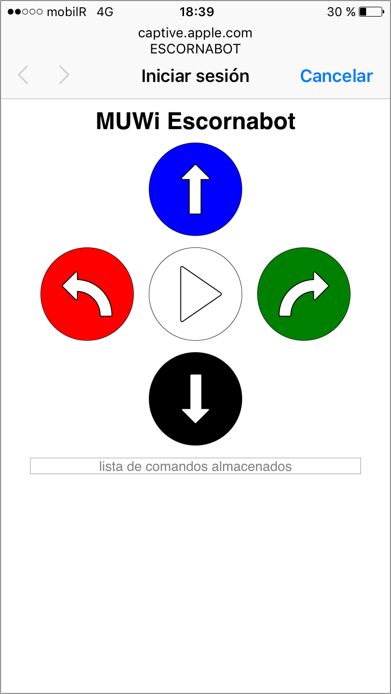
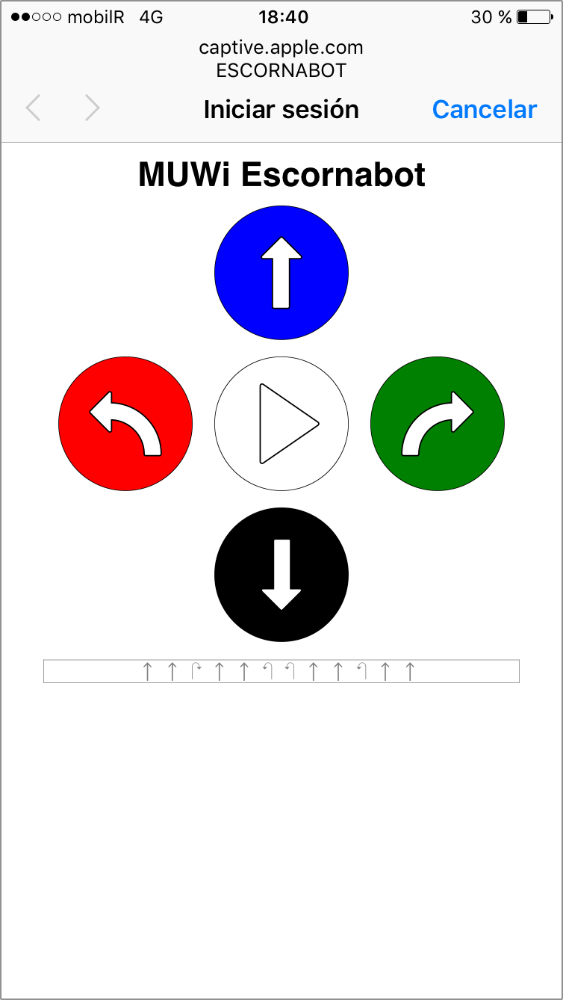

# Mando Universal WiFi para Escornabot

Firmware para el *[módulo ESP-01 de Espressif](https://www.espressif.com/en/products/hardware/esp8266ex/overview)* que añade conectividad WiFi y un mando de control remoto universal para el [Escornabot][ESCGH].

## Descarga

Descarga la **[última versión aquí](https://github.com/escornabot/esp-muwi/releases/latest)**

## Instalación

Utiliza cualquier herramienta para programar tu ESP-01 con el firmware de la
carpeta *MUWi*.

Puedes encontrar un artículo con los detalles aquí:

https://mgesteiro.com/articles/muwi/

## Capturas

 

<!-- links -->
[ESCGH]: https://github.com/escornabot/
